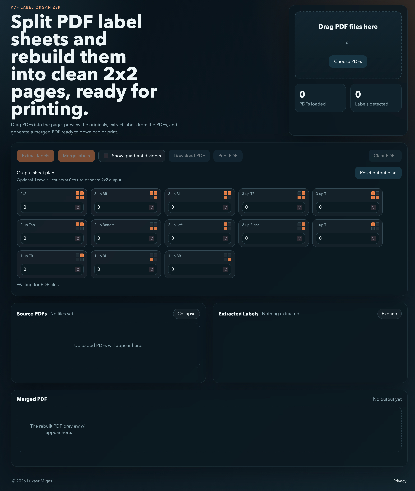

# PDF Organizer

An app for splitting, previewing, reordering, and merging PDF labels.

[Available online](https://lukasz-migas.github.io/pdf-organizer/)



## Supported file types

The app currently accepts PDF files and supports these label extraction layouts:

- `2x2`: an A4 page split into four equally spaced quadrants.
- `1x1`: a whole-page label that should be treated as a single label.
- `2x1 (cropped)`: a label taken from the bottom `40%` of an A4 page, trimmed horizontally, then rotated.

Each uploaded PDF can be assigned a layout manually from the UI before extraction.

## Deploy

This project is a static site. It can be deployed directly to:

- GitHub Pages
- Netlify
- Cloudflare Pages
- Vercel

The app is self-contained and ships its browser dependencies from the local `vendor/` folder, so it does not need runtime CDN access.

### GitHub Pages

1. Push this project to a GitHub repository.
2. In the repository settings, open `Pages`.
3. Set the source to deploy from the default branch root.
4. Save and wait for GitHub Pages to publish the site.

Because this repo includes a [`.nojekyll`](./.nojekyll) file, GitHub Pages will serve the site as plain static files without Jekyll processing.

### Netlify / Cloudflare Pages / Vercel

1. Import the repository.
2. Configure it as a static site.
3. Set the publish directory to the repository root.
4. No build command is required.

## Local run

Serve the folder over HTTP:

```bash
python3 -m http.server 8000
```

Then open `http://localhost:8000`.

## Document type defaults

- Filenames starting with `vinted-` default to `1x1` when the file is under `100 KB`, and to `2x1 (cropped)` when it is over `100 KB`.
- Filenames starting with `returnLabel` default to `1x1`.
- Filenames starting with `order-number`, `orders-<date>`, or `ebay` default to `2x2`.
- Hash-like filenames made of mixed letters and digits default to `2x1 (cropped)`.
- Everything else defaults to `2x2`.

These are only defaults. Each uploaded PDF can still be reassigned manually in the UI.
